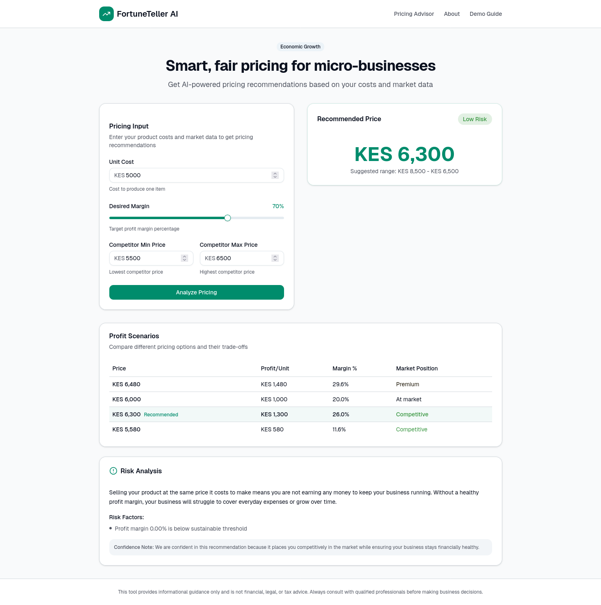

# FortuneTeller AI

**Description:**
FortuneTeller is an AI-powered agent that helps small businesses make informed pricing decisions. It considers costs, desired margins, and competitor pricing to recommend price ranges, profit scenarios, and associated risk levels. The system also uses an LLM to provide human-readable explanations of its recommendations.

This project was built as part of a **48-hour AI Agents Hackathon** and follows ethical, explainable AI principles.

---

## Demo


## Table of Contents

- [FortuneTeller AI](#fortuneteller-ai)
  - [Demo](#demo)
  - [Table of Contents](#table-of-contents)
  - [Project Structure](#project-structure)
  - [Frontend](#frontend)
  - [Backend](#backend)
  - [Setup Instructions](#setup-instructions)
    - [1. Backend](#1-backend)
    - [2. Frontend](#2-frontend)
  - [Environment Variables](#environment-variables)
  - [Usage](#usage)
  - [Architecture](#architecture)
  - [SDG Alignment](#sdg-alignment)
  - [Limitations](#limitations)
  - [License](#license)

---

## Project Structure

```
Root
├── Frontend/      # React + Next.js Web UI
├── Backend/       # Go (FastAPI-style service) with LLM integration
└── README.md
```

---

## Frontend

**Tech Stack:**

* React + Next.js (TypeScript)
* Tailwind CSS for styling

**Structure Highlights:**

* `app/` – main application pages
* `components/` – reusable UI components (form, results, explanation card)
* `hooks/` – React hooks for state management and API calls
* `lib/` – utility libraries
* `public/` – static assets
* `styles/` – global styles

**Features:**

* Input form for unit cost, desired margin, and competitor prices
* Displays recommended price, price range, profit scenarios, and risk
* Shows LLM-generated explanation of recommendations
* Responsive and minimal UI for quick demo

---

## Backend

**Tech Stack:**

* Go
* REST API endpoints
* OpenRouter LLM integration (`google/gemini-3-flash-preview`)

**Structure Highlights:**

```
cmd/server/main.go           # Entry point for backend service
internal/
  config/                    # Env handling & configuration
  handlers/                  # HTTP request handlers (pricing, ping)
  middleware/                # Rate limiting
  models/                    # Data structures for API
  services/                  # Pricing engine, risk engine, LLM integration
```

**Features:**

* `api/price/recommend` endpoint for pricing recommendations
* Computes recommended price, price ranges, and risk
* Uses LLM for explanation and reasoning
* Rate-limited to prevent abuse

---

## Setup Instructions

### 1. Backend

1. Navigate to the `Backend` directory:

```bash
cd Backend
```

2. Create a `.env` file in the backend root with your OpenRouter API key:

```env
OPENROUTER_API_KEY=<your-api-key>
```

3. Install dependencies and run the service:

```bash
go mod tidy
cd cmd/server
go run .
```

The backend will start a REST API server (default port 8080).

---

### 2. Frontend

1. Navigate to the `Frontend` directory:

```bash
cd Frontend
```

2. Install dependencies:

```bash
npm install
```

3. Run the development server:

```bash
npm run dev
```

The frontend will be available at `http://localhost:3000`.

> The frontend will call the backend API for pricing recommendations. Ensure the backend is running.

---

## Environment Variables

**Backend:**

| Variable             | Description                                                         |
| -------------------- | ------------------------------------------------------------------- |
| `OPENROUTER_API_KEY` | API key for OpenRouter LLM access (`google/gemini-3-flash-preview`) |

> Obtain an API key by registering with OpenRouter, then create a key.

---

## Usage

1. Open the frontend in your browser
2. Enter product information:

   * Unit cost
   * Desired margin
   * Competitor min & max prices
3. Click **“Analyze Pricing”**
4. View:

   * Recommended price
   * Price range
   * Profit scenarios
   * Risk assessment
   * LLM explanation of reasoning

---

## Architecture

**Flow:**

```
Frontend Form --> Backend /price/recommend
        --> Pricing Engine --> Risk Engine --> LLM Service
        --> Structured Response (JSON) --> Frontend
```

* **Pricing Engine:** Calculates recommended price & profit scenarios
* **Risk Engine:** Scores potential risks based on inputs
* **LLM Service:** Generates human-readable explanation
* **Frontend:** Displays results in a user-friendly UI

---

## SDG Alignment

This project aligns with **SDG 8: Decent Work and Economic Growth** by supporting small businesses to make sustainable, informed pricing decisions.

---

## Limitations

* Assumes accurate input data (costs, competitor prices)
* Does not account for brand perception or marketing factors
* LLM explanation may vary slightly depending on API output
* Rate-limited to prevent excessive token usage

---

## License

This project is open for educational and hackathon purposes.
Use responsibly and do not rely on this tool for financial/legal advice.
